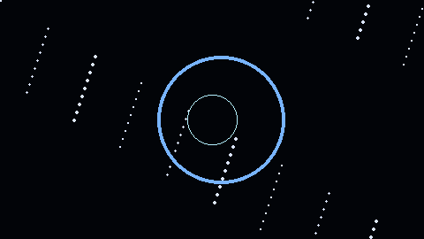

# 3D Galaxy Portfolio

[](#demo) [](https://nodejs.org/) [](https://threejs.org/) [](LICENSE)

A polished single-page portfolio for Vaibhav Suvarna featuring an interactive 3D galaxy, animated sections, and refined UI micro-interactions.

> **Live Site:** [heisenberghz.github.io/personal-portfolio-dashboard](https://heisenberghz.github.io/personal-portfolio-dashboard/)

---

## Table of Contents

- [About](#about)
- [Demo](#demo)
- [Features](#features)
- [Tech Stack](#tech-stack)
- [Quick Start](#quick-start)
- [Project Structure](#project-structure)
- [Customization](#customization)
- [Contributing](#contributing)
- [Notes](#notes)
- [Contact](#contact)

---

## About

This repository contains a modern portfolio website built with WebGL-powered visuals and immersive interactions. It highlights skills, projects, certifications, and contact details while delivering a premium frontend experience.

## Demo

<!-- Replace `assets/demo.gif` with a short GIF (max ~5s) showing the galaxy and camera scroll. -->


Run locally and open `http://localhost:3000` to view the live portfolio.

## Features

- 3D galaxy scene built with `three.js`
- Animated planets, particles and camera motion
- Smooth scroll navigation and anchored sections
- Custom cursor with hover and magnetic navbar effects
- Loader animation with progress bar
- Ambient audio toggle (Web Audio API)
- Back-to-top button and scroll progress indicator
- Responsive, neon-inspired styling

## Tech Stack

- HTML5
- CSS3
- JavaScript (ES Modules)
- `three.js`
- `GSAP` (via importmap)
- `serve` for local development

## Quick Start

Copy and run these commands:

```bash
# clone repository (replace URL)
git clone https://github.com/vaibhavsuvarna/galaxy-portfolio.git
cd galaxy-portfolio

# install dependencies
npm install

# run local server (opens at http://localhost:3000)
npm run dev
```

Visit:

```text
http://localhost:3000
```

## Project Structure

```text
.
├── index.html
├── style.css
├── package.json
└── js
    ├── audio.js
    ├── cards.js
    ├── galaxy.js
    ├── main.js
    ├── planets.js
    └── scroll.js
```

## Customization

- Edit page content in `index.html` (sections: `#hero`, `#about`, `#projects`, etc.)
- Tweak visuals and animation parameters in `js/` modules
- Update theme and layout in `style.css`
- Replace `assets/demo.gif` with a short screen recording for the README hero

## Contributing

Contributions are welcome.

Suggested flow:

1. Fork
2. Create a branch: `git checkout -b feat/your-change`
3. Commit: `git commit -m "feat: describe change"`
4. Push and open a PR

Open an issue before starting larger work.

## Notes

- External libs are loaded via the import map in `index.html`.
- Ambient audio may require user interaction to start in some browsers.
- `npm run dev` uses `npx serve . -p 3000` (no build step).

